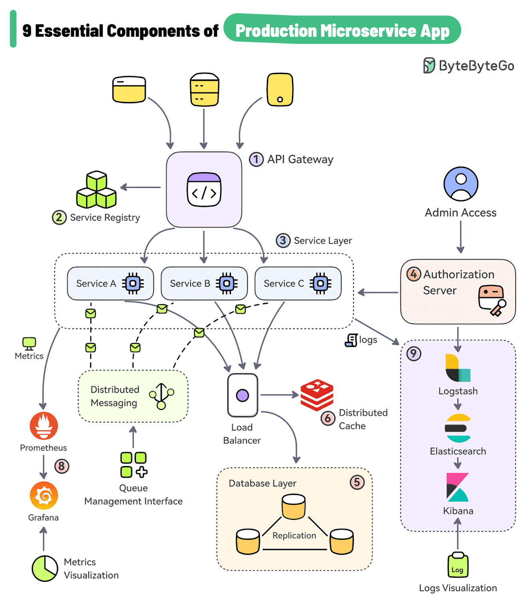

# 🏗️ Microservices Structure

**Estrutura base para desenvolvimento de microsserviços com Docker e Python, integração no frontend com Node.js e React. Suporte a ánalise de dados**

[](LICENSE)
[]()
[]()
[]()

## 📌 Sumário

1. [Sobre o Projeto](#-sobre-o-projeto)  
2. [Objetivos](#-objetivos)  
3. [Tecnologias](#-tecnologias)  
4. [Funcionalidades](#-funcionalidades)  
5. [Pré-requisitos](#%EF%B8%8F-pré-requisitos)  
6. [Instalação](#%EF%B8%8F-instalação)  
7. [Como utilizar](#-como-utilizar)
8. [Estrutura do Projeto](#-estrutura-do-projeto)
9. [Contribuição](#-contribuição)  
10. [Licença](#-licença)  
11. [Contato](#-contato)  
12. [Recursos Adicionais](#-recursos-adicionais)  

## 💻 Sobre o Projeto  

O **Microservices Structure** é um projeto pessoal que demonstra a implementação de uma arquitetura de microsserviços. Ele visa ilustrar como diferentes serviços, desenvolvidos em linguagens distintas, podem se comunicar e operar de forma coesa em um ambiente distribuído. Além disso, o projeto integra ferramentas robustas de monitoramento e análise de dados para fornecer insights valiosos sobre o comportamento dos serviços com Prometheus e Fragana.

- *Motivação*: Proporcionar um modelo prático para entender os conceitos de microsserviços, comunicação entre serviços, e orquestração com Docker e a importância da observabilidade e análise de dados para Data Science.
- *Público-alvo*: Desenvolvedores back-end e arquitetos de software e analistas.

## 🎯 Objetivos  

### 🛠️ Técnicos  
- Demonstrar a comunicação entre microsserviços em diferentes linguagens (Python e TypeScript).
- Implementar um API Gateway para roteamento de requisições externas para os serviços internos.
- Garantir isolamento de dependências e configurações por serviço.
- Utilizar Docker para conteinerização e orquestração dos serviços.
- Integrar ferramentas essenciais como logging, monitoramento e CI/CD.
- Integrar Prometheus para coleta de métricas e Grafana para visualização e análise de dados, com foco em observabilidade e Data Science.

## 🚀 Tecnologias  

**Núcleo do Sistema**
- Python
- Typescript
- React
- Css
- Docker
- Prometheus
- Grafana
- FastAPI
- MongoDB
- Redis
  
## ✨ Funcionalidades  

- ✅ **API Gateway:** Ponto de entrada unificado para os serviços.
- ✅ **Integração com banco de dados**: MongoDB.
- ✅ **Serviço de Autenticação (auth-service):** Gerencia a autenticação de usuários.
- ✅ **Serviço de Calculadora (calculator-service):** Fornece funcionalidades de cálculo.
- ✅ **Serviço de Aplicação (app-service):** Exemplo de serviço de lógica de negócios.
- ✅ **Serviço de Temporizador (timer-service):** Exemplo de serviço com lógica temporal.
- ✅ **Frontend:** Interface de usuário para interagir com os microsserviços.
- ✅ **Monitoramento** e Análise de Dados:
  - **Prometheus:** Coleta de métricas e dados operacionais dos microsserviços.
  - **Grafana:** Criação de dashboards intuitivos para visualização e análise de métricas, permitindo insights profundos para Data Science e otimização do sistema.

## ⚙️ Pré-requisitos  

- Node.js e npm (para o frontend).
- Docker e Docker Compose (necessários para construir e orquestrar os serviços, incluindo Prometheus e Grafana).
- Conexão estável à internet  

## 🛠️ Instalação  

1. Clone o repositório:
```bash
git clone https://github.com/lucasgleria/microservices-structure.git
```

2. Navegue até a pasta do projeto:
```bash
cd microservices-structure
```

3. Instale as dependencias dos frontend:
```bash
cd frontend
npm install
```

4. Crie um arquivo .env na pasta frontend para mudar a URL
```bash
PORT=3001 # Ou de sua preferencia

# Portas utilizadas (NÃO COLOQUE NENHUMA DELAS AQUI)
# 5000, 5001, 5002, 5003, 8000, 8080, 3000, 6379, 27017
```

5. Volte para a pasta raiz
```bash
cd ..
```

6. Crie um arquivo .env na pasta raiz do projeto
```bash
SECRET_KEY=sua_chave_secreta # Utilizei "mysupersecretkey123"
ALGORITHM=H256
REDIS_URL=redis://redis:6379 # Ou a sua porta
MONGO_URI=mongodb://mongo:27017 # Ou a sua porta
MONGO_DB_NAME=nome_do_seu_banco # Utilizei "microsserives-app
ACESS_TOKEN_EXPIRE_MINUTES=30 # Ou o que preferir
```

7. Construa e inicie todos os serviços (incluindo Prometheus e Grafana) com Docker Compose:
```bash
docker-compose up --build
```

## ❗ Como Utilizar

Após a instalação, todos os serviços, incluindo Prometheus e Grafana, estarão em execução.

1. Navegue até o frontend e inicie:
```bash
cd frontend
npm start 
```

2. Acesse no seu navegador:
- **Para utilizar a aplicação:** http://localhost:8000/
- **Prometheus:** Acesse a interface do Prometheus em http://localhost:9090 (porta padrão do Prometheus).
- **Grafana:** Acesse a interface do Grafana em http://localhost:3000 (porta padrão do Grafana). Você pode fazer login com as credenciais padrão (admin/admin) e explorar os dashboards pré-configurados (se houver) ou criar novos para analisar as métricas coletadas pelo Prometheus.

### ▶️ Demonstração




_(Gif meramente ilustrativo)_

## 📂 Estrutura do Projeto  
```plaintext
├── api-gateway/            # Serviço de API Gateway
├── app-service/            # Exemplo de serviço de aplicação
├── auth-service/           # Serviço de autenticação
├── calculator-service/     # Serviço de calculadora
├── frontend/               # Aplicação de frontend
│   ├── src/                
│   │   ├── components/     # Componentes reutilizáveis
│   │   ├── context/        # Estado Global
│   │   ├── styles/         # CSS modularizado
│   ├── App.tsx             # Componente raiz
│   ├── App.css             # Módulo css componente raiz  
├── monitoring/             # Configurações de monitoramento
├── timer-service/          # Serviço de temporizador
├── docker-compose.yml      # Configuração para orquestração Docker
├── .gitignore              
├── LICENSE                 # Licença MIT
└── README.md               # Este arquivo
```

## 🤝 Contribuição

Contribuições são bem-vindas! Siga estas etapas:  

1. **Reporte bugs**: Abra uma [issue](https://github.com/lucasgleria/microservices-structure/issues) no GitHub.  
2. **Sugira melhorias**: Envie ideias ou *pull requests* com novas funcionalidades.  
3. **Desenvolva**:  
   - Faça um *fork* do projeto.  
   - Crie uma branch (`git checkout -b feature/nova-funcionalidade`).  
   - Envie um *Pull Request*.  


## 📜 Licença  

MIT License - Veja [LICENSE](LICENSE) para detalhes.

## 📞 Contato & Evidências

- **Autor**: [Lucas Leria](https://github.com/lucasgleria)  
- **LinkedIn**: [lucasgleria](https://www.linkedin.com/in/lucasgleria/)  

## 🔍 Recursos Adicionais

- [Docker](https://docs.docker.com/) - Documentação oficial
- [Node.js](https://nodejs.org/pt) - Documentação oficial
- [Typescript](https://www.typescriptlang.org/docs/) - Documentação oficial
- [Grafana](https://grafana.com/docs/) - Documentação oficial  
- [Prometheus](https://prometheus.io/docs/) - Documentação oficial  
